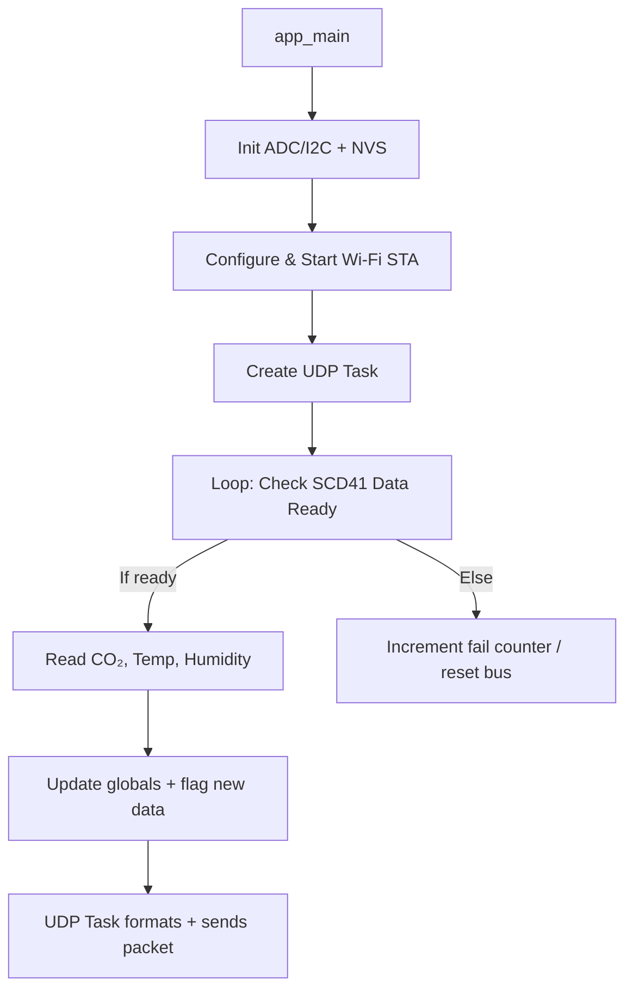

# SensorBroadcast (ESP32 + SCD41)

> ESP-IDF application that connects an ESP32 to Wi-Fi, polls a **Sensirion SCD41** CO₂/temperature/humidity sensor over I²C, reads a local **ADC** channel, and **broadcasts measurements via UDP**.

[](https://docs.espressif.com/projects/esp-idf/en/latest/esp32/)  

---

## Features
- Our device streams telemetry packets over **UDP** to configurable IP/port(s).
Currently, at the very minimum the following hardware schematic can be followed:


## Software Architecture



Edit these macros `hello_world_main.c`.
```
#define EXAMPLE_ESP_WIFI_SSID  "YourSSID"
#define EXAMPLE_ESP_WIFI_PASS  "YourPassword"

#define I2C_SDA_GPIO   21
#define I2C_SCL_GPIO   22
#define TEST_INPUT_ADC_PIN GPIO_NUM_34

// Destination UDP IP/Port
const char *dst_ip   = "192.168.1.100";
uint16_t dst_port    = 12345;
```

To run use the ESP idf to build in the classical manner. The main file is named `hello_world_main.c`, the other 2 are availiable for individual feature testing.:
```
idf.py set-target esp32
idf.py menuconfig   # (optional) adjust configs
idf.py build
idf.py -p /dev/ttyUSB0 flash monitor
```
